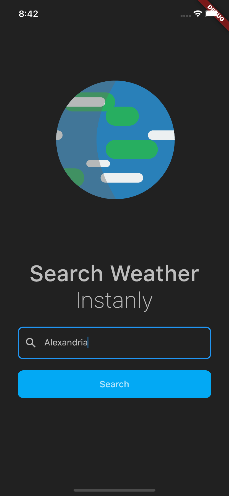
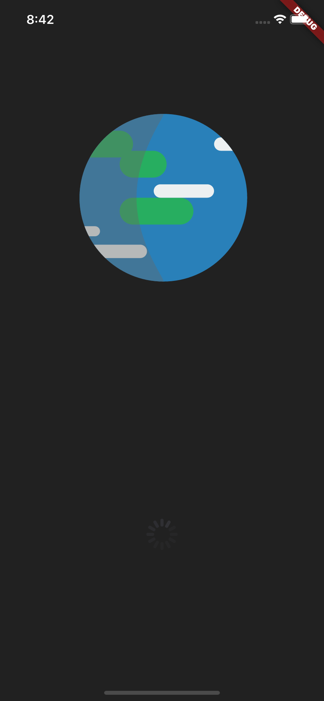
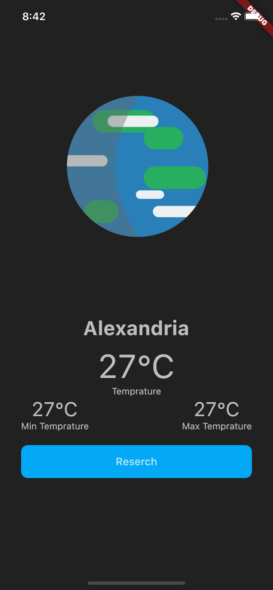

# BLoC Weather App

A demo flutter app to display weather data for any city with [Flare animation](https://rive.app/a/ArkangelB/files/flare/worldspin/preview "Flare animation") in which I used BLoC for state management with MVC.

This demo app is fully working and it is very well suited for beginners who want to take a look at the BLoC State management solution for Flutter.

I highly recommend taking a look at the [BLoC design pattern](https://medium.com/flutter-community/handling-network-calls-like-a-pro-in-flutter-31bd30c86be1 "BLoC design pattern") in Flutter, it will give you a very big idea about the BLoC library

> this project is bassed on [Easy Approach](https://github.com/themaaz32/WeatherAppWithBloc "Easy Approach") project with a some modifications. 

to be continued...

## Screenshots

 

